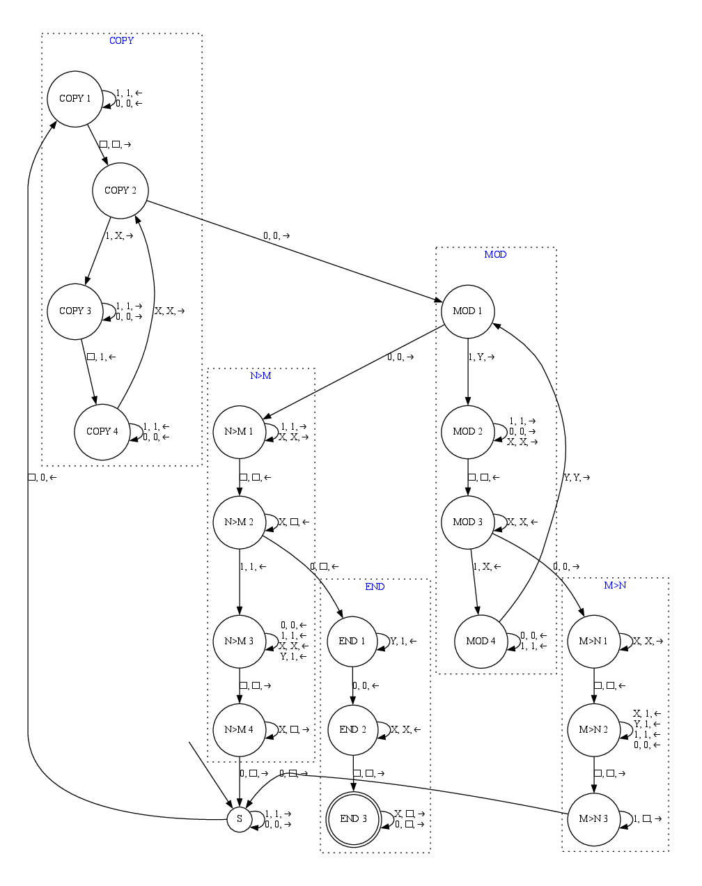

# A Turing Machine in Python

This project is a simple Turing machine that I
originally wrote to check my homework. It eventually got a little out of hand,
and now it can generate animations and state diagrams as well as test.

# Usage

- Begins at left-most symbol of input tape
- States are defined using a python dictionary (you can actually use Json!).
- Each state has a list of transitions associated with it
- Transitions are defined as: `["current symbol", "replacement symbol", "direction to move", "next state"]`

```python
import turing

states = { "S": {
        "transitions": [
            ["1", "3", "->", "S"],
            [" ", " ", "->", "F"],
        ],
    },
    "F": {
        "transitions": [],
        "final": True
    },
}
T = turing.machine(states, debug=True)
T.plot("state_diagram")
T.test("11111011")
# will animate most recent test
T.animate("usage.gif")
```

I'll let the function of the above machine be an exercise for the reader.

# GCD

A common function one might want to implement with a Turing machine is the greatest common denominator (GCD) function.

This is the recursive python version:

```python
def gcd(n, m):
    if m != 0:
        return gcd(m, n % m)
    else:
        return n
gcd(8, 12)
# outputs 4
```

The following Turing machine takes 2 numbers in unary 111111110111111111111 (8,12) and calculates the GCD.



